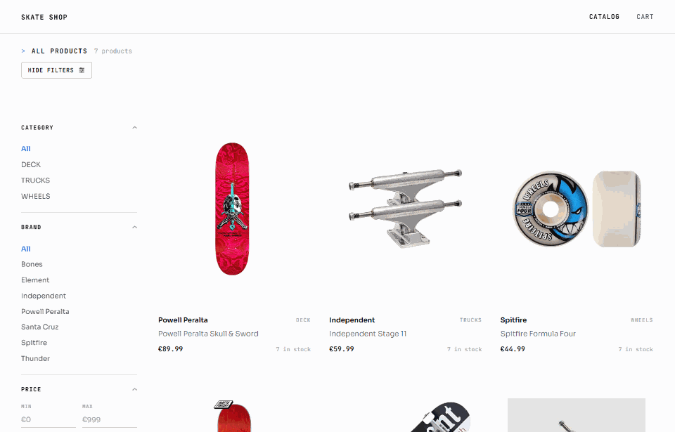
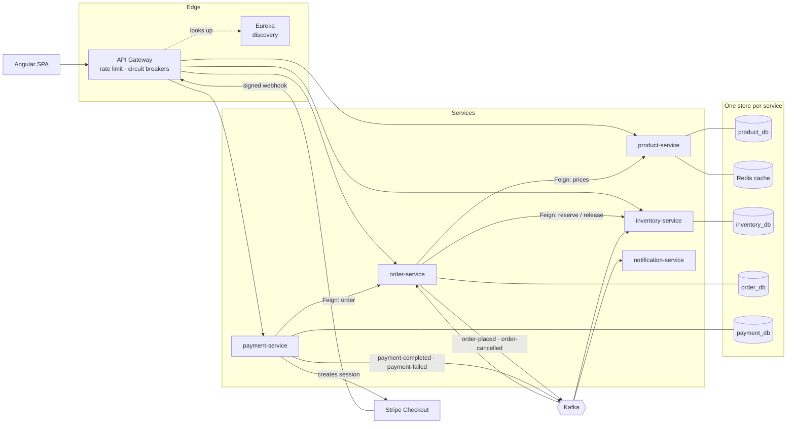
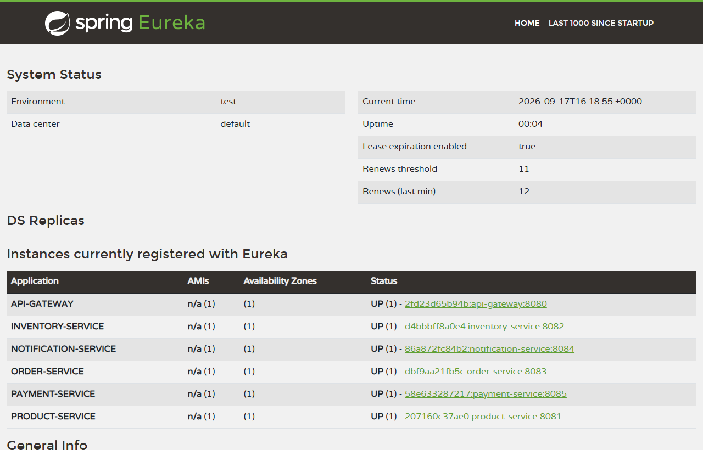
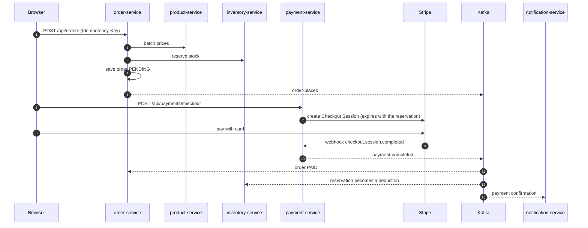
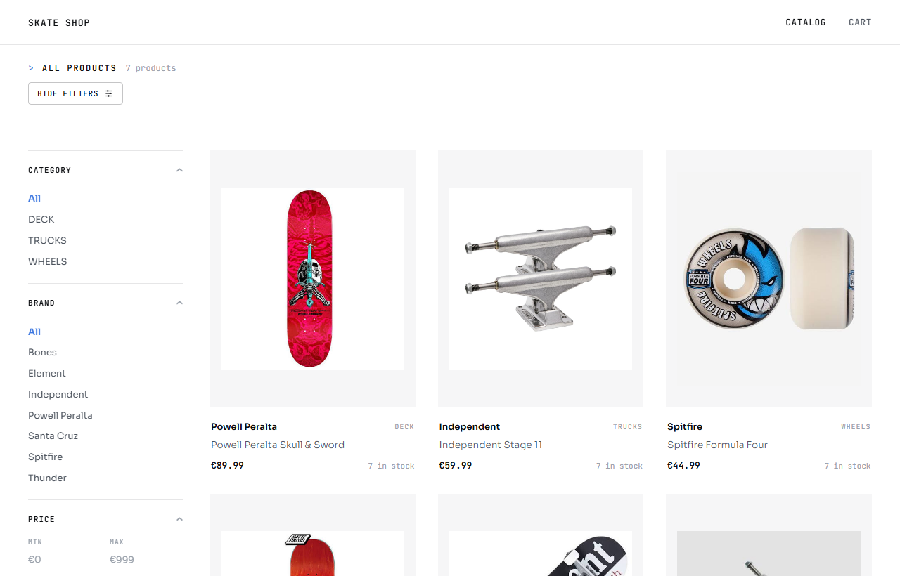
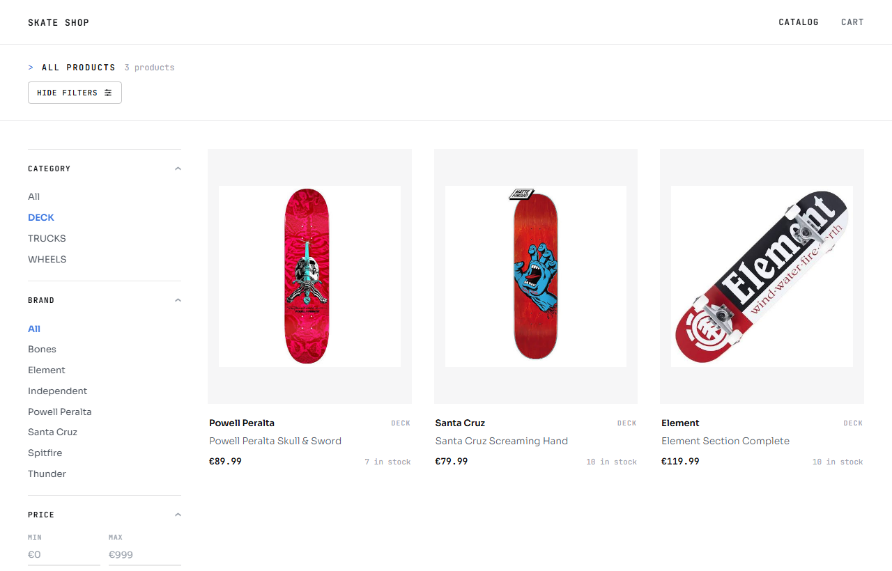
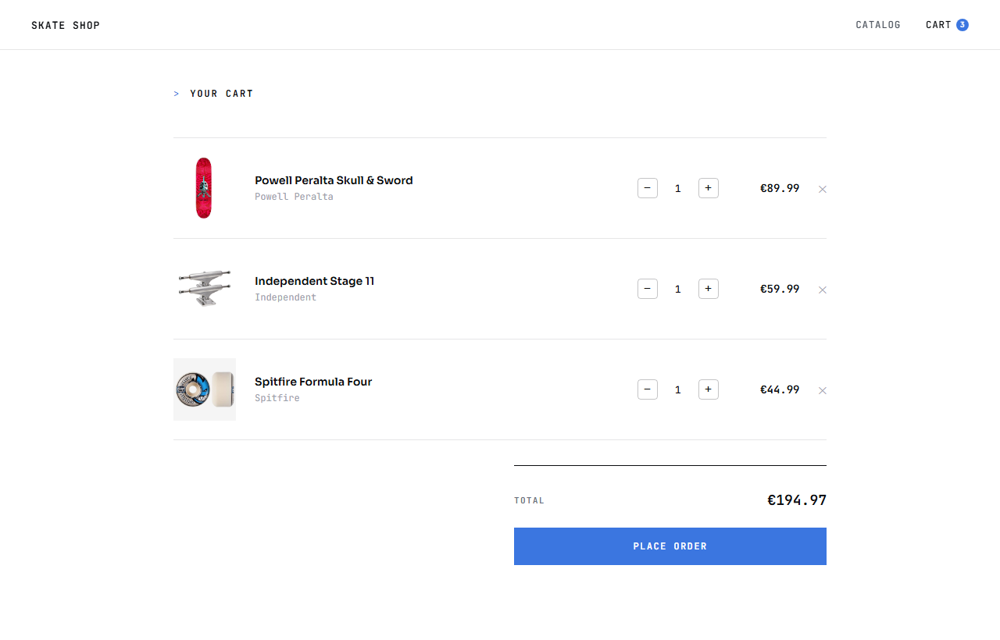
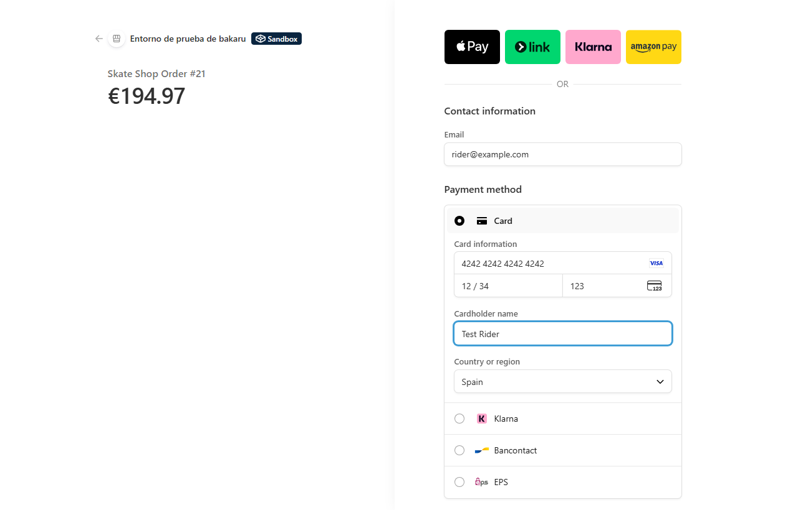

# Skate Shop

[](https://github.com/bakaruu/skate-shop/actions/workflows/ci.yml)

**An e-commerce backend split into six Spring Boot microservices that never share a database. Orders reserve stock
before payment, Stripe settles them, and Kafka carries the outcome to every service, so a double click, a repeated
webhook or an abandoned checkout never oversells a board.**



*Stripe runs in test mode. [Screenshots](docs/images) · [API reference](docs/index.html) ·
[OpenAPI specs](docs/openapi)*

## What it does

- **Sells** skateboard decks, trucks and wheels from a catalog filtered by category, brand and price. The catalog is
  cached in Redis for five minutes and evicted whenever a product changes.
- **Reserves stock when the order is placed**, not when it is paid. Totals are calculated from `product-service`
  prices, never from what the browser sends.
- **Takes payment** through a real Stripe Checkout Session. Signed webhooks decide whether the order is paid or
  cancelled, and a repeated webhook changes nothing.
- **Propagates the outcome through Kafka**: orders move to `PAID` or `CANCELLED`, stock is deducted or released, and a
  notification is issued (logged; no real email is sent). Once the order exists, no service calls another.
- **Cleans up after itself**: a scheduled sweep cancels orders left unpaid past their TTL and releases their stock,
  and the Stripe session expires at the same moment, so it can't be paid later.
- **Protects the edge**: one gateway with service discovery, a circuit breaker and fallback per service, a per-IP
  rate limit and a correlation ID that follows a request across HTTP and Kafka.

The Angular 21 frontend exists to prove the whole flow works end to end. Authentication is deliberately out of
scope; it is covered in [User Management API](https://github.com/bakaruu/user-management-api).

## Architecture



Every service registers in Eureka, and the gateway routes `/api/products`, `/api/inventory`, `/api/orders` and
`/api/payments` to healthy instances. Each service owns its PostgreSQL database and its Flyway migrations. The only
code they share is the `common` module: event types, error responses and correlation ID propagation.



### Checkout, step by step



If the session expires instead, `payment-failed` makes `order-service` cancel the order and publish
`order-cancelled`, and `inventory-service` releases the reservation. If no webhook ever arrives,
`OrderExpiryScheduler` does the same once the TTL has passed.

## Edge cases handled

| What goes wrong | Protection |
|-----------------|------------|
| The browser sends a lower price | Totals are recalculated from `product-service` prices |
| Two customers buy the last board at once | Stock is reserved synchronously when the order is placed; database `CHECK` constraints keep `reserved ≤ quantity` and nothing negative |
| A double click or a retried request creates two orders | `Idempotency-Key` header with a unique index returns the original order |
| Stripe delivers the same webhook twice | Payments already `COMPLETED` or `FAILED` are skipped; one payment per order (`UNIQUE`) |
| The same Kafka event is consumed twice | `processed_order_events` with `UNIQUE (topic, order_id)` in `inventory-service` |
| A cancellation restocks items that were never deducted | The `paid` flag on `order-cancelled` chooses between restocking and releasing; both branches are tested |
| The customer abandons the checkout | Expiry sweep cancels the order and releases stock; the Stripe session expires at the same time |
| The expiry sweep and a payment webhook update the same order | Optimistic locking (`version`) makes one of them fail loudly |
| Saving the order fails after stock was reserved | Best-effort release as a compensating action (see the gap below) |
| A slow or failing service drags the gateway down | Circuit breaker per route (window of 10 calls, 50 % failures, 10 s open) with a fallback response |
| One client floods the API | Bucket4j token bucket per IP on `/api/**`: 60 requests per minute by default |
| A forged webhook | Stripe signature verified with the webhook secret |

## Distributed transactions: a saga, not a two-phase commit

`order-service`, `inventory-service` and `payment-service` each commit to their own database. Consistency comes from a
saga: local transactions, each with a compensating action for when a later step fails. Both saga styles are used.

**Order creation is orchestrated.** `order-service` calls the other services in order and undoes what it did:

| Step | Service | If it fails |
|---|---|---|
| 1. Fetch authoritative prices | `product-service` | Nothing to undo (read-only); returns 400/503 |
| 2. Reserve stock | `inventory-service` | Nothing reserved yet; `409` stops before anything is saved |
| 3. Save the order as `PENDING` | `order-service` | **Compensation:** release the reservation from step 2 |
| 4. Publish `order-placed` | Kafka | Informational only; nothing downstream depends on it |

**Everything after checkout is choreographed.** There is no coordinator; each service reacts to events:

| Trigger | `order-service` | `inventory-service` | `notification-service` |
|---|---|---|---|
| `payment-completed` | status → `PAID` | reservation becomes a real deduction | confirmation |
| `payment-failed` (session expired) | status → `CANCELLED`, publishes `order-cancelled` | reservation released | failure notice |
| No webhook ever arrives | `OrderExpiryScheduler` cancels after `reservation-ttl-minutes` | reservation released (`paid=false`) | failure notice |
| Customer returns from Stripe with "back" | frontend cancels the pending order at once | reservation released at once | — |

**The gap it accepts.** If saving the order fails and the compensating release also fails, the reservation stays
stuck: there is no order row for the expiry sweep to find. A production system would add an outbox or a job that
audits reservations against orders. This project documents that window instead of building the tooling.

## Services

| Service | Port | Responsibility | Store |
|---|---|---|---|
| `discovery-service` | 8761 | Eureka registry | — |
| `api-gateway` | 8080 | Single entry point: routing, circuit breakers, rate limit, correlation IDs | — |
| `product-service` | 8081 | Catalog, filters, batch price lookup | PostgreSQL + Redis |
| `inventory-service` | 8082 | Stock, reservations, deductions and releases | PostgreSQL |
| `order-service` | 8083 | Orders, idempotency, saga orchestration, expiry sweep | PostgreSQL |
| `notification-service` | 8084 | Kafka consumer for customer notifications | — |
| `payment-service` | 8085 | Stripe Checkout Sessions and webhooks | PostgreSQL |
| `common` | — | Shared events, error handling, correlation ID filters and interceptors | — |
| `frontend/skate-shop-frontend` | 4200 | Angular SPA: catalog, cart, checkout, confirmation | — |

## Screenshots

| Catalog | Filtered by category |
|---|---|
|  |  |
| **Cart** | **Stripe Checkout (test mode)** |
|  |  |

## Tech stack

Java 21, Spring Boot 3.5, Spring Cloud Gateway, Eureka, OpenFeign, Resilience4j, Bucket4j, Apache Kafka, Redis,
PostgreSQL 16 with Flyway (one database per service), Stripe Java SDK, Testcontainers, JUnit 5, Mockito, Angular 21,
Docker Compose, Jib and GitHub Actions.

## Run locally

Requirements: Docker, and Node.js for the frontend.

**1. Stripe test keys.** Create a `.env` next to `docker-compose.yml` (it is git-ignored):

```
STRIPE_SECRET_KEY=sk_test_...
STRIPE_WEBHOOK_SECRET=whsec_...
# optional: minutes a PENDING order keeps its stock (default 30)
RESERVATION_TTL_MINUTES=30
```

**2. Backend in one command.** Infrastructure and the seven services, from the images CI publishes:

```bash
docker compose up -d
```

Each service applies its own migrations, including the product and stock seed data. Eureka is at
<http://localhost:8761>.

**3. Frontend.**

```bash
cd frontend/skate-shop-frontend
npm install
npx ng serve
```

Open <http://localhost:4200>. All calls go through the gateway at `http://localhost:8080`.

**4. Webhooks.** Stripe cannot reach `localhost` by itself. To see orders become `PAID` locally, forward webhooks with
the [Stripe CLI](https://docs.stripe.com/stripe-cli) and use the secret it prints as `STRIPE_WEBHOOK_SECRET`:

```bash
stripe listen --forward-to localhost:8080/api/payments/webhook
```

Without it, the payment still succeeds in Stripe and the confirmation page appears, but the order stays `PENDING`
until the expiry sweep cancels it.

To run a service from the IDE instead, start `discovery-service` first, then the others, with the same environment
variables in each run configuration.

### Test card

| Field | Value |
|---|---|
| Card number | `4242 4242 4242 4242` |
| Expiry | Any future date |
| CVC | Any 3 digits |

## API documentation

While running, each service exposes Swagger UI: [product](http://localhost:8081/swagger-ui.html),
[inventory](http://localhost:8082/swagger-ui.html), [order](http://localhost:8083/swagger-ui.html) and
[payment](http://localhost:8085/swagger-ui.html). The exported specs live in [docs/openapi](docs/openapi).

## Tests

161 backend tests: unit tests with JUnit 5 and Mockito, plus integration tests against real PostgreSQL, Kafka and
Redis with Testcontainers.

```bash
mvn clean verify   # needs Docker running
```

CI runs the same command on every push and pull request. Docker images are built with Jib and pushed only from
`main`, after the suite is green.

## Author

**Aru** — [GitHub](https://github.com/bakaruu)

## License

MIT — see [LICENSE](LICENSE).
